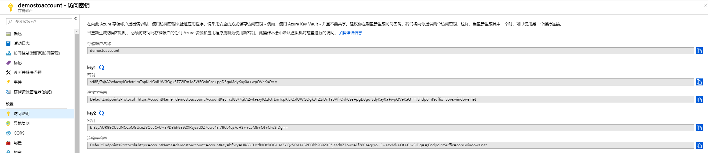

# Azure存储类型

# Azure存储账户

## 存储账户概念

## 创建存储账户

- 账户类型：

  

- 复制：

  

  *Tips*

  - StorageV1缺少分层等属性
  - StorageV1和BlobStorage可升级到StorageV2

  

## 存储账户设置

### 访问密钥

- 整个存储账户控制权限
- 默认两个
- 需定期更换

### 异地复制

### 配置

### 加密

### 防火墙和虚拟网络

# Blob

## 创建Blob容器

### 容器权限

- 专用：无权限用户无法访问
- Blob：无权限用户可以访问指定Blob
- 容器：无权限用户可以查看容器里Blob的list并访问Blob

创建3个不同权限的容器：

## 上传Blob

### Blob类型

- 块Blob：普通文件
- 页Blob：vhd硬盘镜像，需要512字节对齐
- 追加Blob：只能在文件末尾补充数据

## Blob属性

### URL

### 访问层

*Tips*

- 存档层不能直接访问，需要恢复到冷或者热层，需要数小时时间

  

### 容器权限的验证

将同一个图片传到3个不同权限的容器，并在浏览器打开图片的url，可以看到，有Blob和容器权限的容器里的图片可以打开，专有权限的容器里的图片无法打开

## Blob设置

### 自定义域

### 软删除

#### 启用软删除

### CDN

### 添加Azure搜索

### 生命周期管理

# 文件

## 创建文件共享

*Tips*

- 目前配额最大只支持5120GiB
- 按实际使用容量收费，而非配额
- Global支持备份（预览）

## 连接文件共享

*Tips*

- 文件服务为SMB3.0
- Linux有最低版本要求，例如CentOS需要7以上
- SMB3.0加密支持跨广域网连接，但是要求445端口开放
- Linux如果要跨广域网连接，有最低版本要求，例如CentOS需要7.5以上

