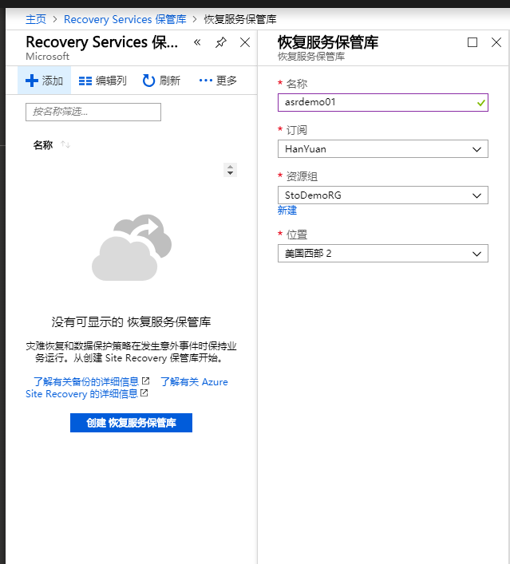
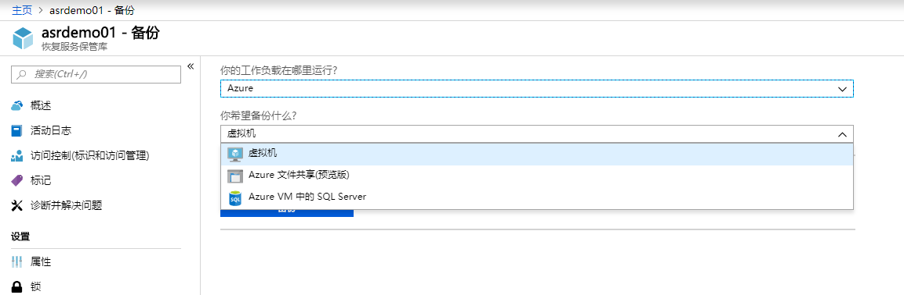
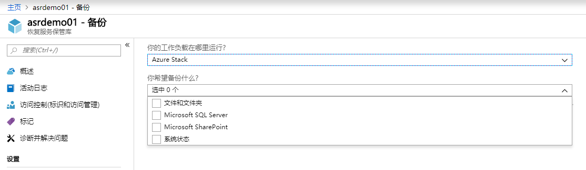
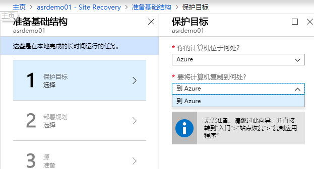
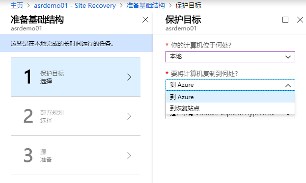
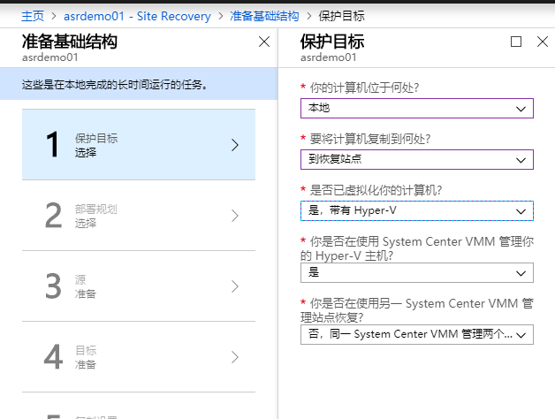

# 托管磁盘

## 托管磁盘概念

## 托管磁盘优势

## 托管磁盘弱势

* 没有url，无法像非托管磁盘一样进行copy等操作
* 只有LRS的复制，无法通过Azure进行存储级跨Region容灾

## 托管磁盘操作

### 列出所有磁盘

`az disk list -o table`

### 创建磁盘

#### 创建一个空白磁盘

`az disk create -g ResourceGroup -n DiskName --sku sku --Size-gb size`

#### 从现有磁盘或快照复制出一块新磁盘

az disk create -g ResourceGroup -n DiskName --sku sku --source Source{Disk|SnapShot}`

*Tips*

- 新磁盘和原盘必须要在同一个Region及资源组
- 如果新磁盘名字与现有磁盘相同，会直接覆盖

#### 删除磁盘

`az disk delete -g ResourceGroup -n DiskName`

#### 从新建磁盘创建vm（新建磁盘必须系统磁盘）

`az vm create -g ResouceGroup -n VMName --attach-os-disk DiskName --os-type {windows|linux}`

# Recovery Service 保管库

## 创建保管库

## 备份支持项

### 备份源为Azure

### 备份源为Azure Stack

### 备份源为本地

*Tips*

* Azure和Azure Stack上的vm也可以当作本地服务器备份os里的文件、应用等

## Site Recovery支持项

### 复制源为Azure

### 复制源为本地

#### 目标为Azure

#### 目标为回复站点

# 备份

