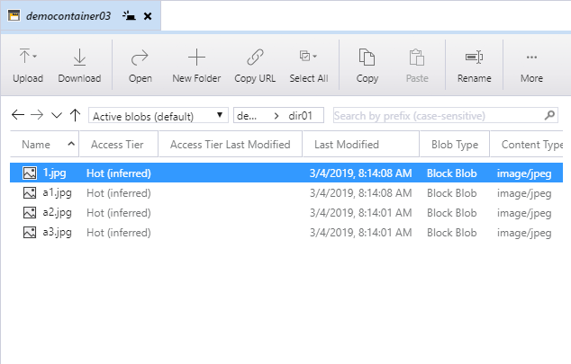
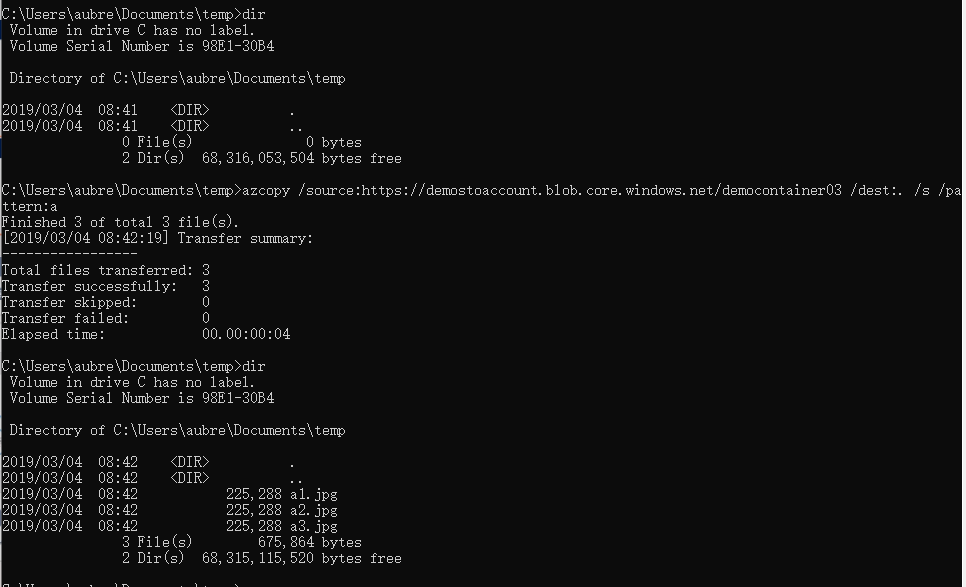

# Azure Storage Explorer操作

## 添加账户

### 基于Azure账号

### 基于Storage Account

### 基于SAS

## Storage操作

# AzCopy

## 设置AzCopy运行环境

## AzCopy基本命令

`AzCopy /Source:<source> /Dest:<destination> [Options] `

### 下载文件

#### 下载单个文件

`azcopy /source:https://demostoaccount.blob.core.windows.net/democontainer03 /dest:. /Pattern:"20140331_024018000_iOS.jpg" `

*Tips*

- source和dest的目标是目录或容器
- 文件通过/pattern参数指定
- 覆盖不会提醒

#### 下载批量文件

现有文件结构

`azcopy /source:https://demostoaccount.blob.core.windows.net/democontainer03 /dest:. /s`

*Tips*

- /s参数指定下载所有文件
- 目录结构将完整复制

#### 下载指定前缀的文件

`azcopy /source:https://demostoaccount.blob.core.windows.net/democontainer03 /dest:. /s /pattern:a`

*Tips*

* 用/pattern参数指定前缀
* 不支持复制目录内的内容

### 容器权限的影响

#### 不加认证

*Tips*

* 容器权限必须是容器才支持不加认证的进行文件下载

#### 使用Account Key

`azcopy /source:https://demostoaccount.blob.core.windows.net/democontainer01 /dest:. /pattern:a1.jpg /sourcekey:sd8B/7sjtA2wfaexyIQzfctrLmTspKlciQxlUWGOgk3TZ2iDn1a8VfFOvkCse+pgD3gui3dyKay0a+wpQVeKaQ==`

*Tips*

* /sourcekey参数可指定存储账户的Account Key，赋予AzCopy权限

#### 使用SAS

`azcopy /source:https://demostoaccount.blob.core.windows.net/democontainer01 /dest:. /pattern:a1.jpg /sourcesas:"?st=2019-03-04T00%3A57%3A40Z&se=2019-03-05T00%3A57%3A40Z&sp=rl&sv=2018-03-28&sr=c&sig=OoJbXncjH0i8DsqipIi3SfTJ%2FI6Ibu%2B%2Fc6FKD3HD2kE%3D"`

*Tips*

* /sourcesas参数可指定存储资源的SAS，赋予AzCopy权限
* SAS连接字符串有特殊字符，需要放在“ ”里

## AzCopy进阶参数

### /XN

排除较新的源资源。 如果源的上次修改时间同于或晚于目标，不会复制该资源。

**适用于：** Blob、文件

### /XO

排除较旧的源资源。 如果源的上次修改时间同于或早于目标，不会复制该资源。

**适用于：** Blob、文件

### /L

仅指定列出操作；不复制任何数据。

AzCopy 使用此选项解释为在没有此选项 /L 的情况下，模拟运行命令行，并对复制的对象数量进行计数，可以同时指定选项 /V 以检查哪些对象要复制到详细日志中。

此选项的行为也由源数据的位置、是否存在递归模式选项 /S 以及文件模式选项 /Pattern 所决定。

使用此选项时，AzCopy 需要此源位置的列出和读取权限。

### /NC:"number-of-concurrent-operations"

指定并发操作的数量。

默认情况下，AzCopy 会启动一定数量的并发操作以提高数据传输吞吐量。 请注意，在低带宽环境中，大量的并发操作可能会压垮网络连接，并且会阻碍操作彻底完成。 请根据实际可用的网络带宽限制并发操作。

并发操作的上限为 512。

**适用于：** Blob、文件、表

### /SyncCopy

指示是否要以同步方式在两个 Azure 存储终结点之间复制 blob 或文件。

AzCopy 默认情况下使用服务器端的异步复制。 指定此选项以执行同步复制，可将 blob 或文件下载到本地内存，并将其上传到 Azure 存储。

在 Blob 存储内复制文件、文件存储内复制文件或者从 Bolb 存储将文件复制到文件存储时，可使用此选项，反之亦然。

**适用于：** Blob、文件

## 其它

如果是上传或azure间复制，请修改对应的/source、/sourcekey、/sourcesas、/dest、/destkey、/destsas等can