# 托管磁盘概念

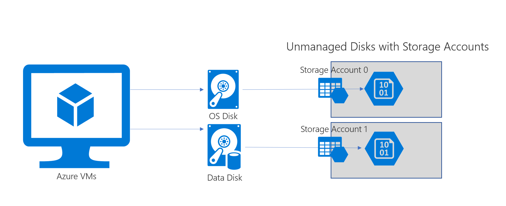

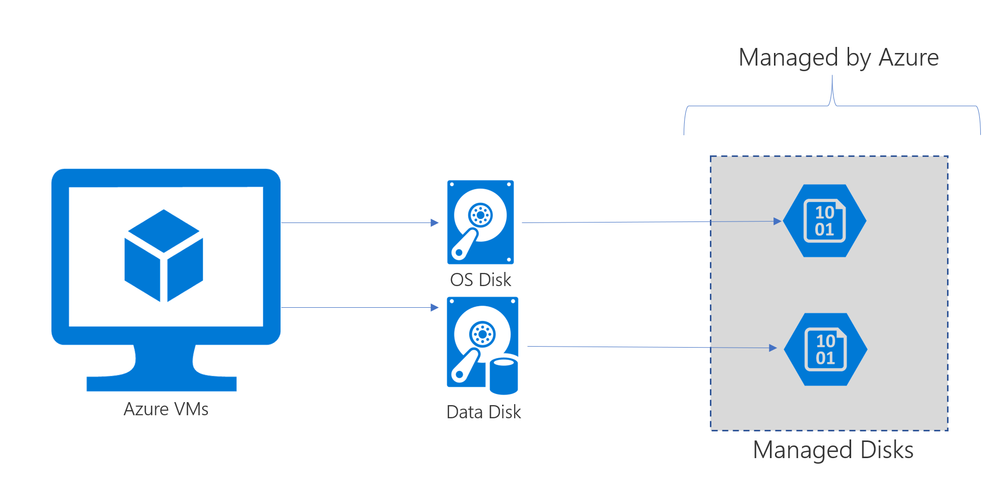

# 托管磁盘优势

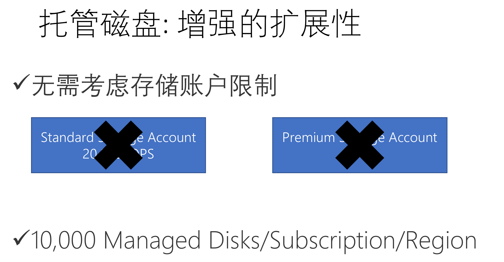

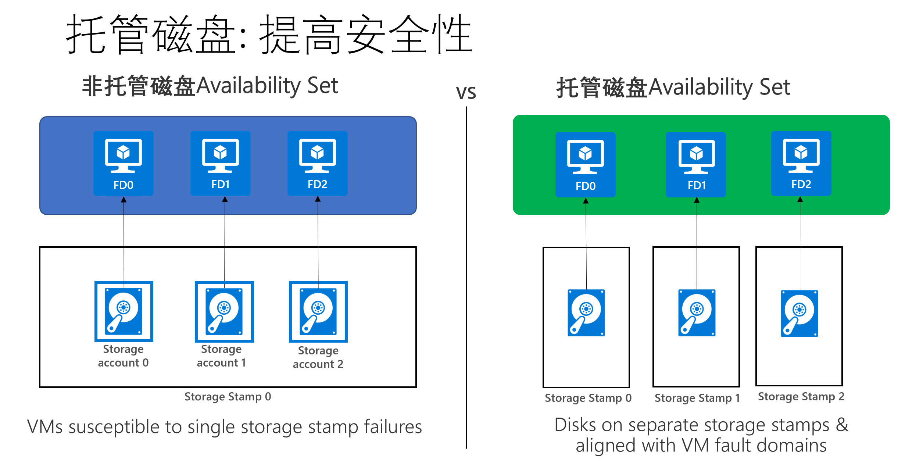

# 托管磁盘弱势

* 没有url，无法像非托管磁盘一样进行copy等操作
* 只有LRS的复制，无法通过Azure进行存储级跨Region容灾

# 托管磁盘操作

## 列出所有磁盘

`az disk list -o table`

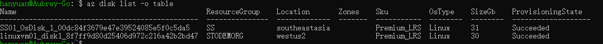

## 创建磁盘

### 创建一个空白磁盘

`az disk create -g ResourceGroup -n DiskName --sku sku --Size-gb size`

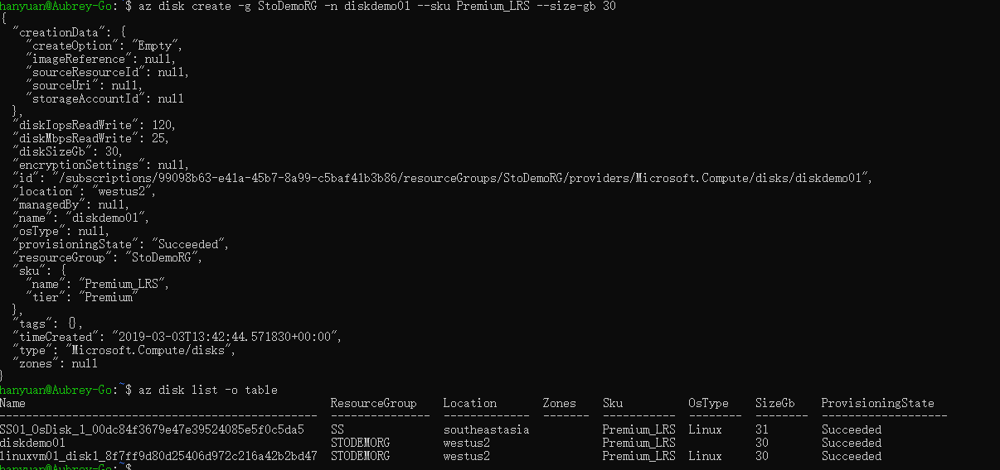

### 从现有磁盘或快照复制出一块新磁盘

az disk create -g ResourceGroup -n DiskName --sku sku --source Source{Disk|SnapShot}`

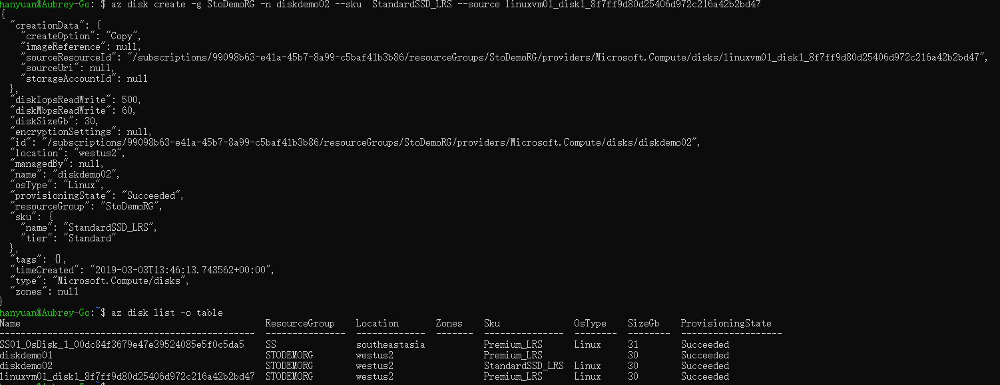

*Tips*

- 新磁盘和原盘必须要在同一个Region及资源组
- 如果新磁盘名字与现有磁盘相同，会直接覆盖

### 删除磁盘

`az disk delete -g ResourceGroup -n DiskName`

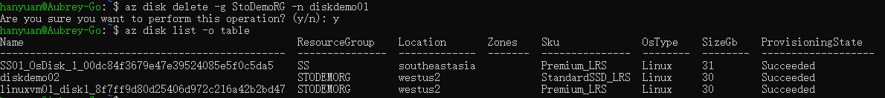

### 从新建磁盘创建vm（新建磁盘必须系统磁盘）

`az vm create -g ResouceGroup -n VMName --attach-os-disk DiskName --os-type {windows|linux}`

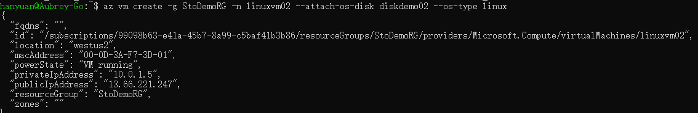

## 托管磁盘快照

### 创建托管磁盘快照

`az snapshot create -g ResourceGroup -n SnapshotName --source DiskName`

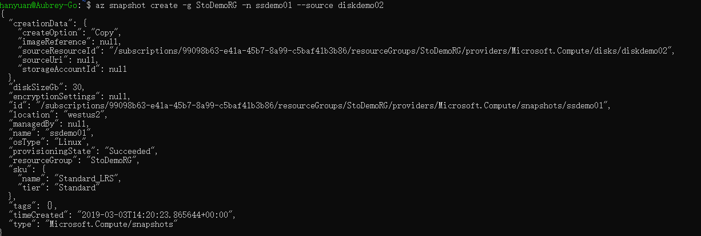

### 通过快照创建磁盘 

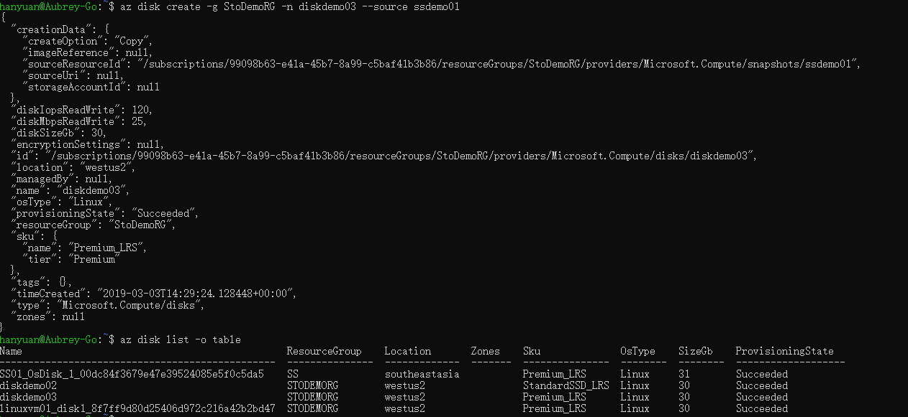

## 托管磁盘的导出

### 直接托管磁盘导出

`az disk grant-access --duration-in-seconds time -g ResourceGroup -n DiskName`

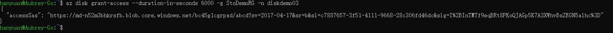

*Tips*

* ‘--duration-in-seconds’表示链接的有效时间，单位为秒，注意根据带宽等实际情况设置，避免磁盘复制时过期
* 中国区目前不支持开机状态下导出，需要先关机并释放资源才能导出

### 快照导出

`az snapshot grant-access --duration-in-seconds time -g ResourceGroup -n SnapshotName`

## 跨Region复制托管磁盘

### 下载后上传

### 直接复制

#### 在目标Region创建存储账户

* Region: EastUS
* ResourceGroup: StoDemoRGEast
* StorageAccount: saeastdemo
* Container: vhds

#### 复制托管磁盘

##### 将链接复制为目标区域的非托管磁盘

`az storage blob copy start --destination-blob BlobName --destination-container ContainerName --account-name AccountName --account-key AccountKey --source-uri uri`

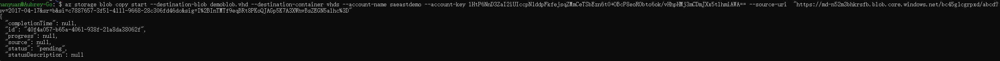

##### 检查复制任务状态

 `az storage blob show --name BlobName --container-name ContainerName --account-name AccountName --account-key AccountKey --query '{status:properties.copy.status}'`

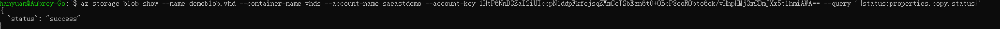

*Tips*

* 通过检查目标Blob的拷贝状态来确认是否已完成，如果显示为“success”说明已完成，可以进行下一步

##### 将非托管磁盘转化为托管磁盘

`az disk create -n DiskName -g ResoureGroup --source BlobUri`

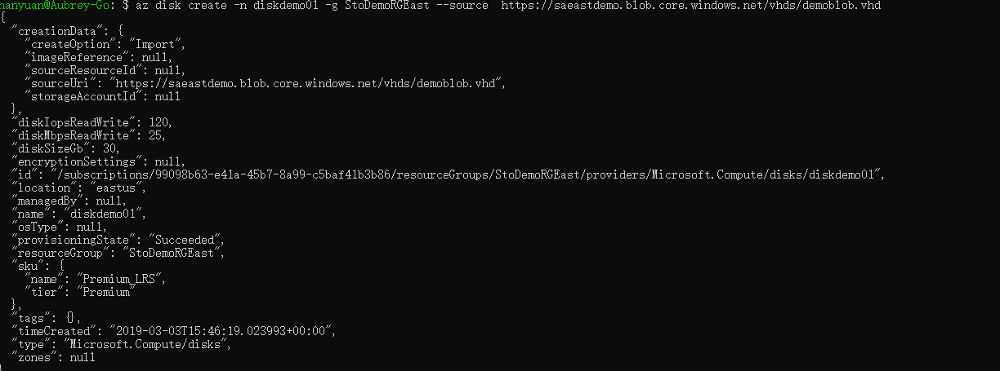

